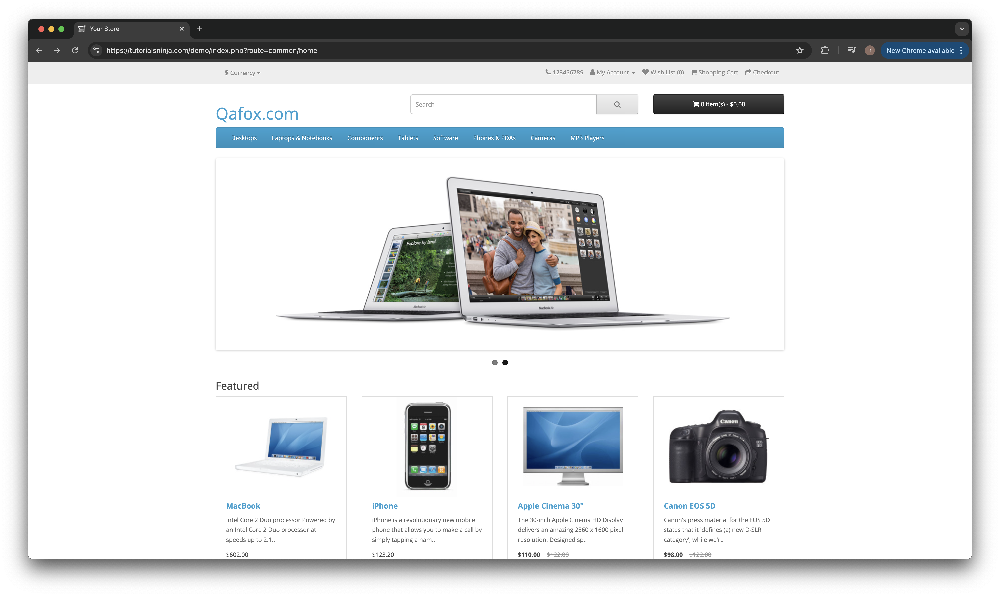
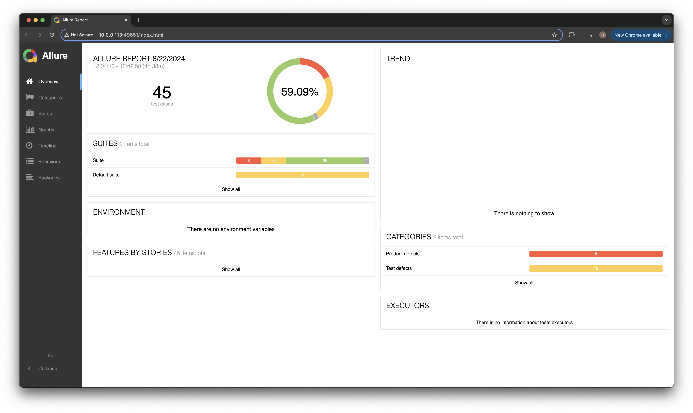
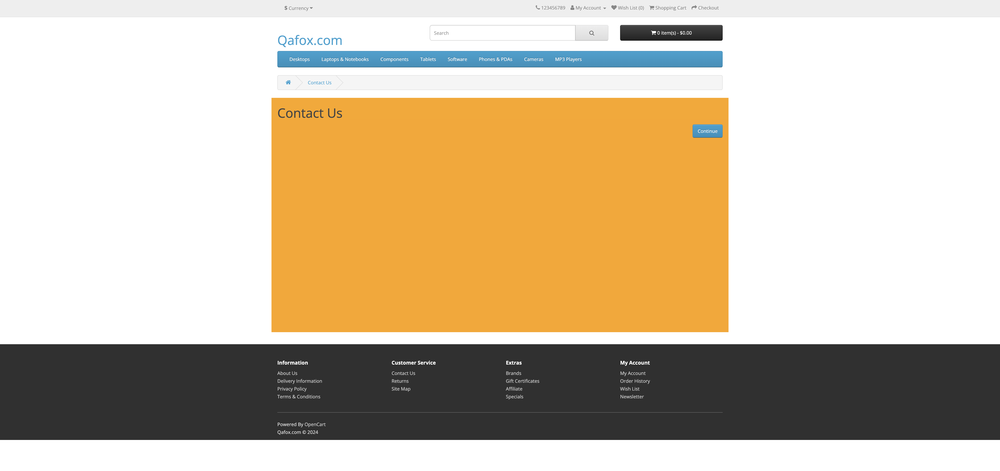
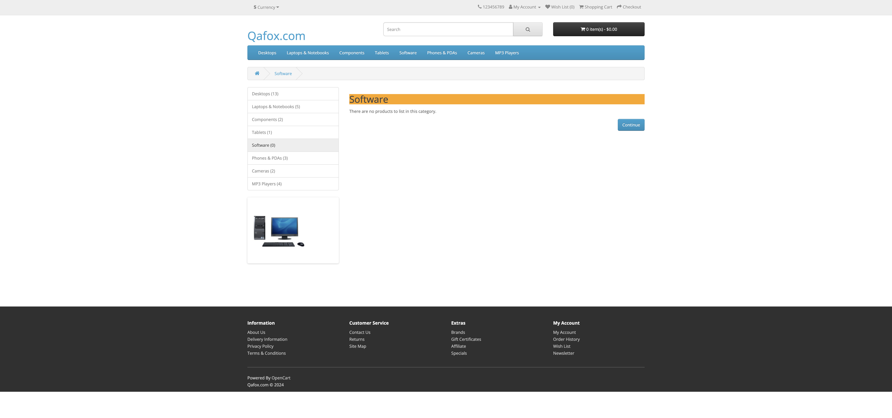

# 💻 My Automation Project 
✅ This is a testing automation demo project that tests a eCommerce demo site called: QAFox.com

https://tutorialsninja.com/demo/index.php?route=common/home

The test scripts included login and logout tests, end to end tests (adding a product until a purchase is completed), adding and removing products from the shopping cart, adding and removing products from the Wish List, price validation tests, and menu and contact validation.

## 📖 Overview

This repository contains a comprehensive automated testing project built with Java, TestNG, and Allure Reports. 
The project follows the Page Object Model (POM) design pattern for a modular and maintainable test suite.

<p>
  
</p>

## 📑 Technologies & Skill & Features
| Technologies      | Description |
| ----------- | ----------- |
| **Java:**      | The project is developed using Java, providing a robust and widely used programming language for automation.       |
| **TestNG:**   | TestNG is used as the testing framework, offering powerful test configuration options, parallel execution, and detailed reporting.        |
| **Selenium WebDriver:**   | The project includes Selenium WebDriver for automating browser interactions        |
| **Page Object Model (POM):**   | The project follows the POM design pattern, enhancing test maintainability and reusability by separating page elements and actions.        |
| **Allure Reports:**   | Test results are documented using Allure Reports, providing a clear and interactive visualization of test execution.        |
| **Jenkins:**   | Continuous integration and continuous delivery (CI/CD) platform for automated builds and deployments.        |


## 📊 Reports
  ```bash
  allure serve allure-results
  ```
<p>
  
</p>

## 📊 Reports Examples
<p>
  
  
</p>

## 🚀 Getting Started

1. **Clone the Repository:**
   ```bash
   git clone https://github.com/Roidv1988/QafoxProject
    ```

## 📁 Project Structure
```
├── ScreenShots
│  
├── allure-results
│  
├── pom.xml
│  
├── src
│   ├── main
│   │   ├── java
│   │   └── resources
│   └── test
│       ├── java
│       │   ├── pages
│       │   │    
│       │   ├── tests
│       │   │   
│       │   └── utils
│       │     
│       └── resources
│           └── data
│               └── conf.properties
├── target
│   ├── classes
│   │   └── META-INF
│   │       ├── MANIFEST.MF
│   │       └── maven
│   │           └── com.qafox
│   │               └── QafoxProject
│   │                   ├── pom.properties
│   │                   └── pom.xml
│   └── test-classes
│       ├── data
│       │   └── conf.properties
│       ├── pages
│       ├── tests
│       └── utils
│           └── Utils.class
├── test-output
│   
└── testng.xml
```

Thanks for visiting my GitHub profile! 😊
Roi Dvide 


